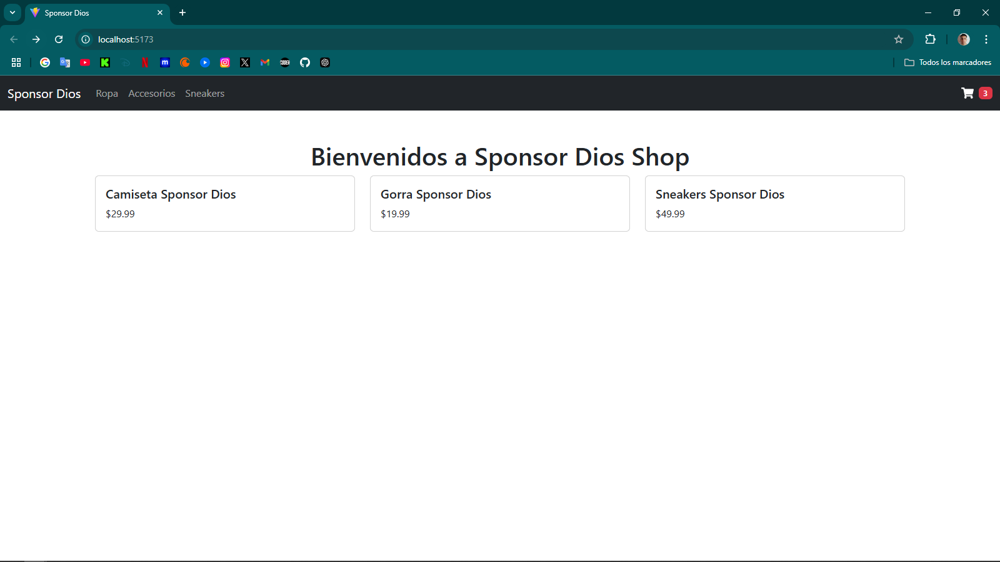

# **Sponsor Dios Shop**  
¡Hola! Este es mi primer proyecto en React usando **JSX**. Es un mini e-commerce llamado **Sponsor Dios Shop**, donde trabajé en implementar varias funcionalidades básicas siguiendo consignas específicas.  

Me inspiré en el diseño y funcionalidad de la página [Sponsor Dios](https://www.sponsordios.shop/) para desarrollar este proyecto. Mi objetivo es crear algo similar, utilizando React y aplicando lo que aprendí en mis estudios.  

---

## **¿Qué hace esta página?**  
La idea del proyecto es tener una base para un e-commerce. Aunque no tiene toda la funcionalidad de una tienda real, cumplí con las siguientes tareas:  
- Crear un **menú de navegación** con categorías clickeables.  
- Mostrar un listado de productos (mockeados, es decir, datos simulados).  
- Agregar un ícono de carrito que muestra un número fijo (por ahora).  
- Usar **Bootstrap** para los estilos básicos.  

---

## **¿Qué contiene el proyecto?**  
### **Carpeta `components`:**  
Dentro de `src/components`, creé los siguientes componentes:  
- **NavBar.jsx**:  
  Es el menú principal. Incluye:  
  - El nombre de la tienda como "brand".  
  - Un listado de categorías clickeables (Ropa, Accesorios y Sneakers).  

- **CartWidget.jsx**:  
  Es un pequeño componente que muestra un ícono de carrito con un número hardcodeado (3).  

- **ItemListContainer.jsx**:  
  Muestra un mensaje de bienvenida (pasado como `prop`) y renderiza una lista de productos.  

### **Archivo `products.js`:**  
Simula un pequeño catálogo con productos mockeados (nombre, precio, categoría, etc.).  

---

## **¿Cómo se ve?**  
Así es como va quedando la página:  

  

---

## **¿Qué puedo mejorar?**  
Este es solo el comienzo, así que me encantaría:  
- Implementar **filtrado de productos** por categoría (Ropa, Accesorios, Sneakers).  
- Hacer que el carrito funcione de verdad: actualizar el número según los productos agregados.  
- Conectar el proyecto con una base de datos como **Firebase** para almacenar productos y manejar pedidos.  
- Agregar una página de **detalles del producto** al hacer clic en un producto.  
- Mejorar los estilos con diseño responsivo para que se vea bien en dispositivos móviles.  
